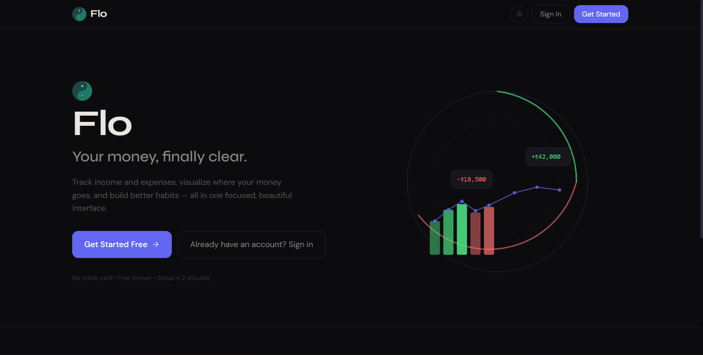

# Flo — Personal Budget Tracker



Flo is a premium, production-ready personal budget tracking application. Designed with the aesthetics of top-tier fintech products (like CRED, Zerodha Kite, and Groww), Flo provides a clean, fast, and focused interface to manage your financial data effortlessly.

## 🚀 Features

- **Beautiful Insights:** Visualize your spending patterns with dynamic Donut and Bar charts using Recharts.
- **Zero Friction Logging:** Add income or expenses in under 10 seconds with our optimized Floating Action Button (FAB) and floating-label forms.
- **Dark & Light Modes:** A meticulously crafted warm dark theme (default) and a crisp light theme, seamlessly toggleable with zero flash of unstyled content.
- **Secure Authentication:** Powered by Supabase, featuring secure signup, login, and protected routing.
- **Real-time Data:** Optimistic UI updates on transactions so the app feels instantly responsive.
- **Responsive Design:** Flawlessly adapts from mobile screens to ultrawide desktop monitors using Tailwind CSS.
- **Premium Animations:** Custom CSS keyframes for smooth fade-ins, springy modal scales, and list staggering.

## 🛠 Tech Stack

- **Frontend Framework:** React 18 (Vite)
- **Routing:** React Router v6
- **Styling:** Tailwind CSS + Vanilla CSS Variables (Themeable)
- **Database & Auth:** Supabase (PostgreSQL)
- **Charts:** Recharts
- **Icons:** Lucide React

## 📦 Getting Started

### Prerequisites

Ensure you have [Node.js](https://nodejs.org/) installed on your machine.
You will also need a [Supabase](https://supabase.com/) project set up.

### Installation

1. Clone the repository and navigate to the directory:
   ```bash
   cd Flo
   ```

2. Install the dependencies:
   ```bash
   npm install
   ```

3. Set up your environment variables. Create a `.env` file in the root directory and add your Supabase credentials:
   ```env
   VITE_SUPABASE_URL=your_supabase_project_url
   VITE_SUPABASE_ANON_KEY=your_supabase_anon_key
   ```

4. Run the development server:
   ```bash
   npm run dev
   ```

5. Open your browser and navigate to the local or network IP provided by Vite (e.g., `http://localhost:5173`).

---

*Designed and engineered to make tracking your money feel like an upgrade.*
